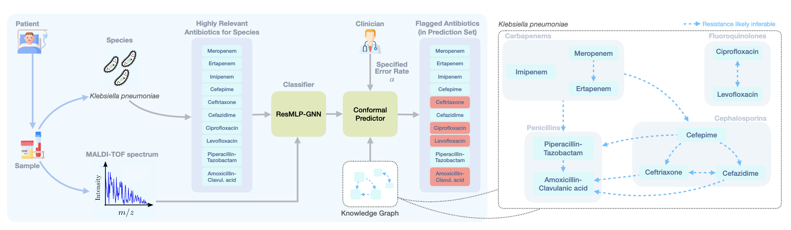
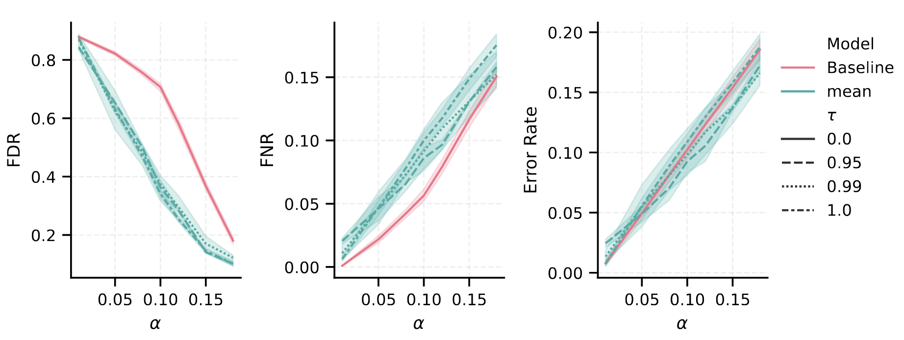
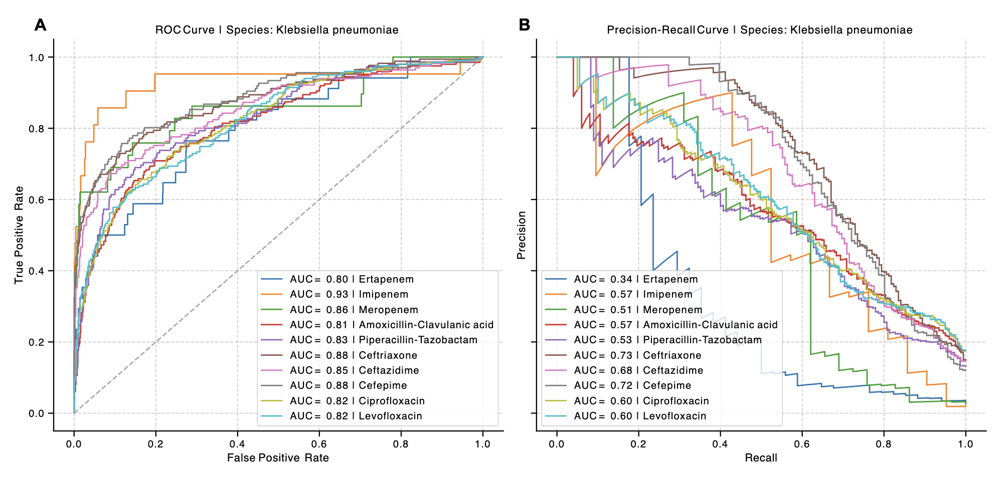

# ConformalAMR

This repository contains the code used to conduct experiments presented in the paper _Antimicrobial drug recommendation from MALDI-TOF mass spectrometry with statistical guarantees using conformal prediction_, by Nina Corvelo Benz, Lucas Miranda, Dexiong Chen, Janko Sattler, and Karsten Borgwardt.

### Abstract

Antimicrobial resistance (AMR) is a global health challenge, complicating the treatment of
bacterial infections and leading to higher patient morbidity and mortality. Rapid and reliable identification of resistant pathogens is crucial to guide early and effective therapeutic interventions. However, traditional culture-based methods are time-consuming, highlighting the need for faster predictive approaches. Machine learning models trained on MALDI-TOF mass spectrometry data, readily collected
in most clinics for fast species identification, offer promise but face limitations in clinical applicability, particularly due to their lack of comprehensive, statistically valid uncertainty estimates. Here, we introduce a novel AMR prediction framework that addresses this gap with a novel knowledge graphenhanced conformal predictor. Conformal prediction (CP) constructs prediction sets with statistical
coverage guarantees, ensuring that bacterial resistance to a certain antibiotic is flagged with a specified
error rate. 



Our proposed conformal predictor constructs improved prediction sets over standard CP approaches by using a knowledge graph capturing the interdependencies in antibiotic resistance patterns.



In addition, we introduce a novel classifier framework that improves upon previous multimodal models by incorporating multigraph-based antibiotic representations using state-of-the-art self-supervised
methods. Besides increasing resistance detection for most tested species-drug combinations, the presented architecture, termed ResMLP-GNN, overcomes the limitations of previous efforts and supports
multi-drug antibiotics that are highly relevant in clinical practice. We successfully evaluated our approach on a set of highly-relevant antibiotics, commonly used in clinics to treat infections with Klebsiella pneumoniae and Escherichia coli



### Installation

We provide `pyproject.toml` and `poetry.lock` files for reproducible installation of the environment used in our experiments using [poetry](https://python-poetry.org/). We recommend to do this within a conda/mamba isolated environment, containing `Python^=3.11`. To install the environment, run the following command (assuming you have poetry up and running):

```bash

mamba create -n ConformalAMR python=3.11
poetry install

```
